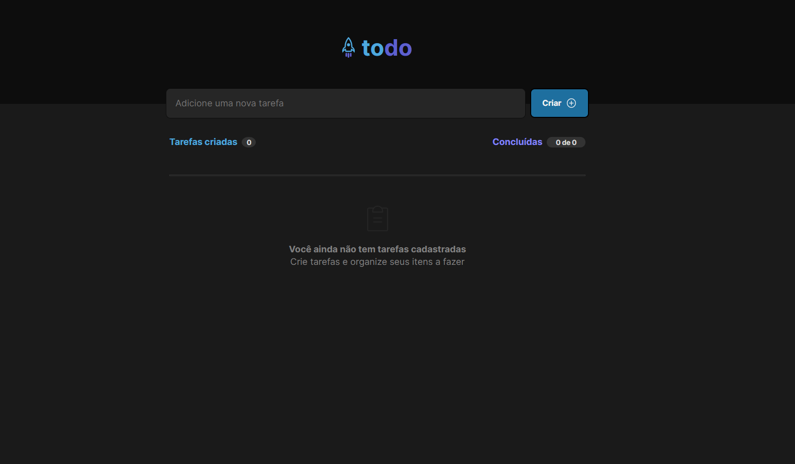
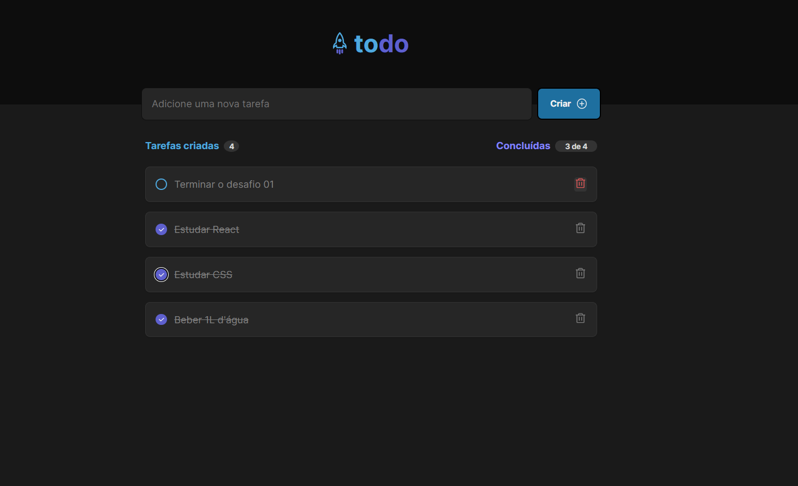

<h1 align="center">
    
</h1>

<h4 align="center"> 
	🚀Ignite React  
</h4>

    
 
  

  <a href="#technologies">Technologies</a>&nbsp;&nbsp;&nbsp;|&nbsp;&nbsp;&nbsp;
  <a href="#information">About</a>&nbsp;&nbsp;&nbsp;

## ✏ About

This project is the first hands-on challenge of the 2022 ignite react track by [RocketSeat]. The project is a task control application(to-do list).

[Figma](<https://www.figma.com/file/fijdfKlYGZ5uad1pbh9vOR/ToDo-List-(Copy)?node-id=0%3A1>)

   

## :technologies: 🛠 Technologies and Libs:

the following technologies and libs:

- [React]
- [Typescript]
- [CSS3]
- [Phosphor Icons]

Made with ♥ by Whey :wave: [Get in touch!](https://www.linkedin.com/in/wheyckson-lopes/)
